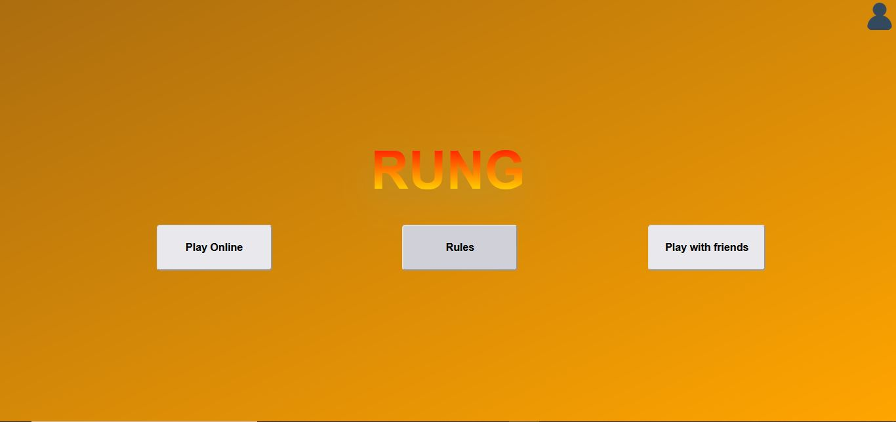
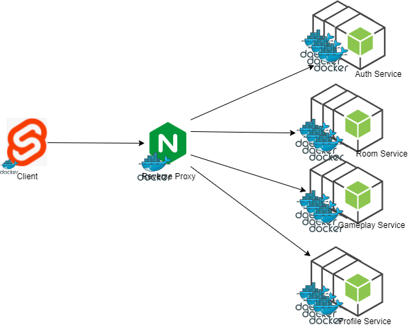
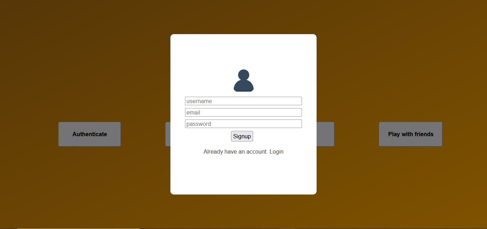
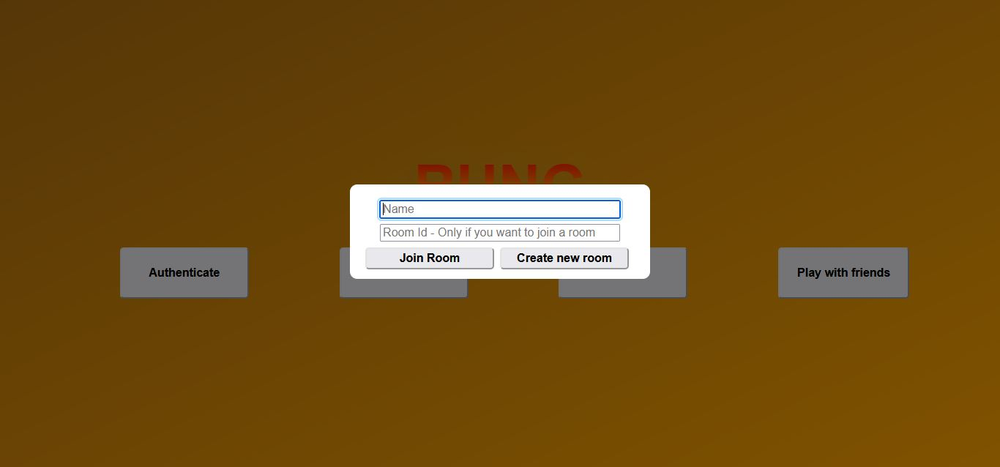
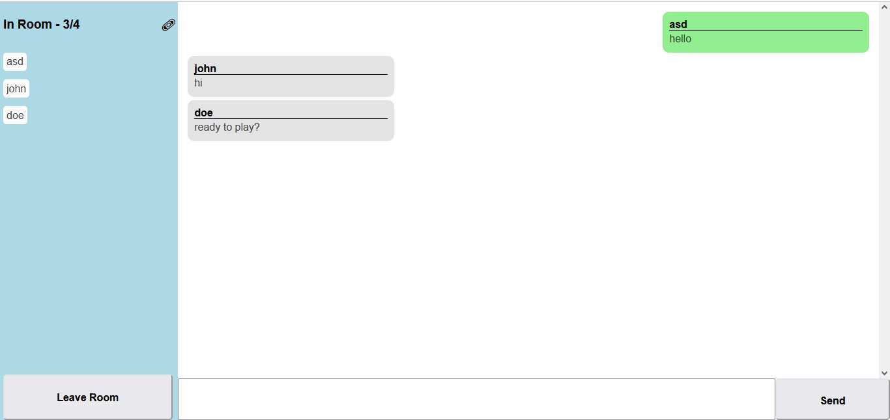
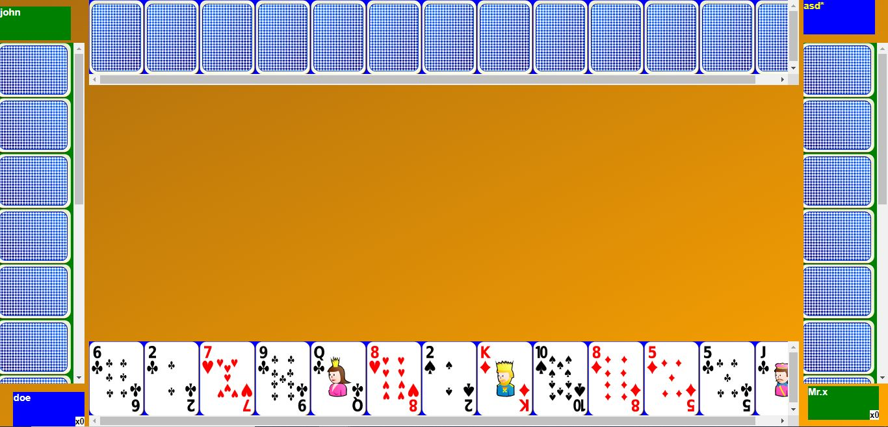
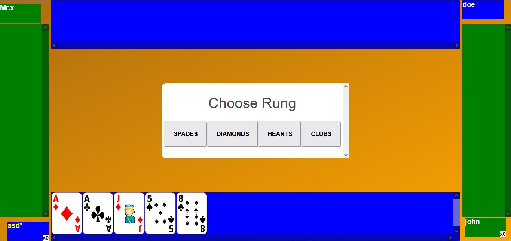
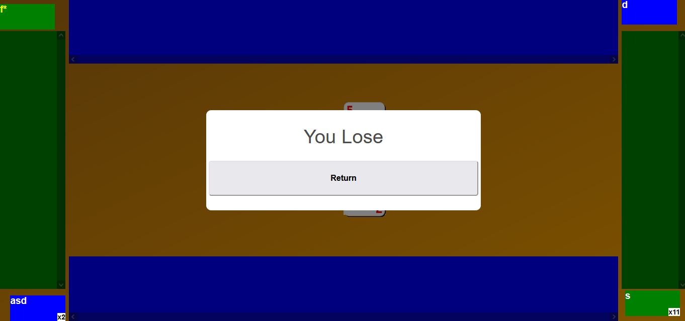
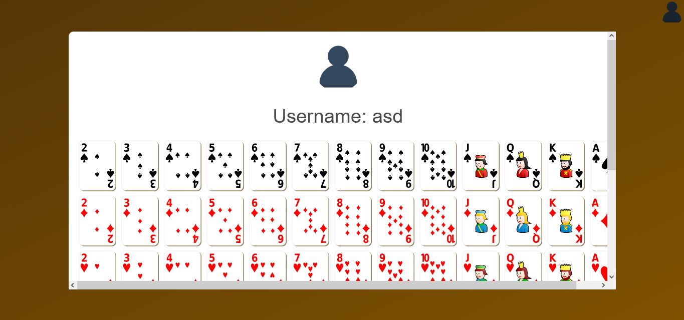

**Rung**, a four player card game played with two groups competing to take the most tricks. Our implementation is a webapp which allows for four players to play with each other using a code (called as friends mode) and also play with strangers on internet (called as online mode). While waiting for other players to join, players are placed into an intermediary room where they can chat with one another.

# Architecture

## Client
Client is made using Sveltekit framework. Client need to make two types of connections . 
1) A simple http connection with profile service and auth service
2) A web socket connection with room service and gameplay service

## Nginx
Nginx acts as a reverse proxy between client and services. Client does not need to know of the other services, it just needs to ask Nginx of required data and Nginx will handle the rest. It even caters for the web socket connections.
It also serves as a load balancer between the redundant instances of the same services.

## AuthService
The auth service deals with the authentication needs of the system. The authentication system is needed to play in online mode. The service provides ability to signup, signin and logout. 

## RoomService
The room service provides the logic of intermediary chat room before the start of game while players are waiting for others player to join.
This is done using socket.io. In ‘friends mode’, first a player need to create a room and then s/he can share the room code with other and they can join it. Internally, each player is connected to the socket.io instance of that particular room and they subscribe to message event, so a player sending a message will be received by players that are already in the room. New player joining the room will not receive old messages.

## GameplayService
Gameplay service is the main service and provides the logic of the whole game. Its functionality is similar to room service except that instead of client subscribing to message events they subscribe to multiple game events like dealing of deck, rung and move etc to make sure the game state is consistent throughout all the clients. It also deals with client timeouts and disconnections.

## ProfileService
Profile service holds the authenticated user information and profile picture. It also provides a unique feature of card customization, where authenticated users can change the picture of the card to their liking (though it will have the same value) and then could play with those cards.

